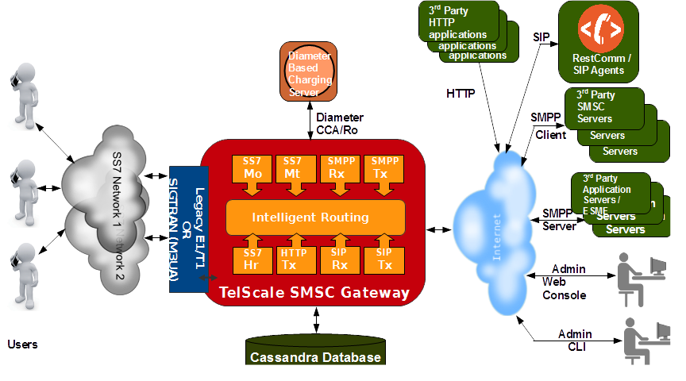

[[_design_overview]]
= Architecture

{this-platform} {this-application} is based on robust and proven {this-platform} JAIN SLEE 1.1 Server and {this-platform} jSS7 Stack and provides easy integration with any third party communication protocol and platform. 

{this-platform} JAIN SLEE Server is a highly scalable event-driven application server with a robust component model and fault tolerant execution environment.
It provides a set of connectors to a variety of networks elements: SS7 MAP, TCAP, INAP, ISUP, SMPP, XMPP, SIP, MGCP, HTTP, XDM, XCAP, Diameter and many others.
It is fully compliant with JSR 240 (JSLEE 1.1). 

{this-platform} jSS7 is a software based implementation of the SS7 protocol.
It provides implementation for Level 2 and above in the SS7 protocol Stack. {this-platform} jSS7 Stack User Guide is bundled within and you can refer to the guide for more details on the Stack. 

The diagram below depicts a high level design of {this-platform} {this-application} .

{this-platform} {this-application} provides six basic services of an SMSC as shown in the figure above.
Each of these six services are implemented in the Gateway as a module that can be activated or deactivated based on the needs of an operator.
All these services interact with the Cassandra database for storing data (messages not yet sent and an archive for sent/failed to send messages) and retreiving data for messages that are pending to be sent. 

{this-platform} {this-application} can accept SMPP (incoming BIND) from ESMEs or can also initiate SMPP (outgoing BIND) to third party SMSC and hence itself acting as an ESME. {this-platform} {this-application} provides intelligent routing rules that can route SMS between various SMPP connections or between SMPP, GSM and SIP Network. 

.Service Modules
Mo (Mobile originated) module::
  Handles mobile originated SMS.

Mt (Mobile terminated)::
  Delivers SMS to mobile.

Rx SMPP module::
  Listens for incoming SMS from ESME/third party SMSC and routes them to Mt module (GSM), other ESME/third party SMSC or SIP Client depending on the routing rule.

Tx SMPP module::
  Delivers SMS to external ESME/third party SMSC received from Mo Module (GSM), ESME/third Party SMSC or SIP Client.

Rx SIP module::
  Listens for incoming SMS from SIP Client and routes them to Mt module (GSM), other ESME/third party SMSC or SIP Client depending on the routing rule.

Tx SIP module::
  Delivers SMS to SIP Client received from Mo Module (GSM), ESME/third Party SMSC or other SIP Client. |  | 

.Administration
CLI::
  {this-platform} {this-application} comes with a Command Line Interface (CLI) that provides easy to use commands to manage and monitor the SS7 Stack and the SMSC Gateway. 

Web Interface::
  {this-platform} {this-application} also includes an easy to use Web Interface administration tool that allows you to manage and monitor the Gateway via a convenient Web console. 

Campaign Tool::
  In addition, future releases will also offer a Web based campaign tool to define and manage campaigns. | 

== Database Table Structure

{this-platform} {this-application} stores messages using Cassandra database.
The database is used for storing unsent messages, messages successfully sent and messages that failed to be sent.

The {this-platform} {this-application} creates three tables for every new day with the date suffixed to the names of the tables as `DST_SLOT_TABLE_yyyy_mm_dd`, `SLOT_MESSAGES_TABLE_yyyy_mm_dd` and `MESSAGES_yyyy_mm_dd` where `yyyy_mm_dd` is the date in that format.
 

Apart from the above tables created everyday, the database also comprises of three other tables namely `CURRENT_SLOT_TABLE`, `SMPP_SMS_ROUTING_RULE` and `SIP_SMS_ROUTING_RULE` created when the SMSC is started for the first time.
The former is used for storing system-wide data and the latter two for storing the routing rules. 

=== CURRENT_SLOT_TABLE

.`CURRENT_SLOT_TABLE`
[cols="1,1,1", frame="all", options="header"]
|===
| Column Name | Data Type | Description
| ID | INT | Acts as a primary key and is unique for each entry. The value acts as an identifier of content: 0 indicates the current due slot that the SMSC processes now and 1 indicates the last assigned messageId.
| NEXT_SLOT | BIGINT | The next slot value.
|===

[[_sms_routing_rule]]
=== SMPP_SMS_ROUTING_RULE

.`SMPP_SMS_ROUTING_RULE`
[cols="1,1,1", frame="all", options="header"]
|===
| Column Name | Data Type | Description
| ADDRESS | Text | Acts as a primary key and is unique for each entry. Stores the address for which the messages are being routed.
| CLUSTER_NAME | Text | The name of the SMPP Cluster.
|===

=== SIP_SMS_ROUTING_RULE

.`SIP_SMS_ROUTING_RULE`
[cols="1,1,1", frame="all", options="header"]
|===
| Column Name| Data Type | Description
| ADDRESS | Text | Acts as a primary key and is unique for each entry. Stores the address for which the messages are being routed.
| CLUSTER_NAME | Text | The name of the SIP Cluster. This is not used as of now and all SMS message are routed through a single SIP stack.
|===

=== DST_SLOT_TABLE_yyyy_mm_dd

This table contains a list of `DUE_SLOT` values for `TARGET_ID` to store the data for this day.
 

.`DST_SLOT_TABLE_yyyy_mm_dd`
[cols="1,1,1", frame="all", options="header"]
|===
| Column Name | Data Type | Description
| TARGET_ID | ASCII | Acts as a primary key and is made up of ADDR_DST_DIGITS+”_”+ADDR_DST_TON+”_”+ADDR_DST_NPI.
| DUE_SLOT | BIGINT | All new incoming messages will be added into this DUE_SLOT if it is not yet processed. If DUE_SLOT has been processed already or is absent, a new DUE_SLOT will be assigned.
|===

=== SLOT_MESSAGES_TABLE_yyyy_mm_dd

This table stores the messages that are scheduled for delivery.
The messages are not deleted after delivery.

The fields "DUE_SLOT", "TARGET_ID", "ID" together act as the primary key.

.`SLOT_MESSAGES_TABLE_yyyy_mm_dd`
[cols="1,1,1", frame="all", options="header"]
|===
| Column Name | Data Type | Description
| ID | UUID | Record Identifier.
| TARGET_ID | ASCII | Made up of ADDR_DST_DIGITS+”_”+ADDR_DST_TON+”_”+ADDR_DST_NPI.
| DUE_SLOT | BIGINT | For which the messages will be loaded for delivering.
| IN_SYSTEM | INT | 0 - idle state, 1 - delivery in progress, 2 - delivery finished (by success or failure)
| SMSC_UUID | UUID | Id of the SMSC session (from start to stop), this is needed to know which session has launched the delivery of a message.
| ADDR_DST_DIGITS | ASCII | Destination address digits.
| ADDR_DST_TON | INT | SMPP style TON (type of number) of destination address.
| ADDR_DST_NPI | INT | SMPP style Numbering Plan Indicator of destination address.
| ADDR_SRC_DIGITS | ASCII | Originating address digits.
| ADDR_SRC_TON | INT | SMPP style TON (type of number) of source address.
| ADDR_SRC_NPI | INT | SMPP style Numbering Plan Indicator of source address.
| DUE_DELAY | INT | Duration (in seconds) after which a new delivery attempt will be done. If the SMS has just arrived in the system, this value is 0.
| ALERTING_SUPPORTED | BOOLEAN | The value is 'true' if SMSC was successfully registered at HLR after delivery failure. However this field is currently not being used because this demands extra database access.
| MESSAGE_ID | BIGINT | A unique message ID assigned by SMSC (since the SMSC started).
| MO_MESSAGE_REF | INT | SMS TPDU Message Reference field.
| ORIG_ESME_ID | TEXT | SMSC internal name of origination ESME (empty for MO messages).
| ORIG_SYSTEM_ID | TEXT | SMPP name of origination ESME (empty for MO messages).
| DEST_CLUSTER_NAME | TEXT | Name of cluster for destination ESME terminated massages (empty for MT messages).
| DEST_ESME_ID | TEXT | SMSC internal name of destination ESME (empty for MT messages).
| DEST_SYSTEM_ID | TEXT | SMPP name of destination ESME (empty for MT messages).
| SUBMIT_DATE | TIMESTAMP | Time when a message was received by SMSC.
| DELIVER_DATE | TIMESTAMP | Time when a message was sent from SMSC (null if message failed to deliver).
| SERVICE_TYPE | TEXT | SMPP parameter (service_type) for ESME originated messages.
| ESM_CLASS | INT | Indicates Message Mode (Messaging Mode==Datagram, Forward or Store and Forward mode) and Message Type (MessageType==some flags including UDH indicator).
| PROTOCOL_ID | INT | Protocol Identifier SMPP parameter (TP-Protocol-Identifier files for GSM).
| PRIORITY | INT | SMPP parameter (priority_flag).
| REGISTERED_DELIVERY | INT | SMPP parameter (registered_delivery).
| REPLACE | INT | SMPP parameter (replace_if_present_flag).
| DATA_CODING | INT | data_coding scheme.
| DEFAULT_MSG_ID | INT | SMPP parameter (sm_default_msg_id).
| MESSAGE | BLOB | Message text in source style that has been received from EMSE or from MS.
| OPTIONAL_PARAMETERS | TEXT | TLVs.
| SCHEDULE_DELIVERY_TIME | TIMESTAMP | SMPP parameter (schedule_delivery_time) - time when SMSC should start a delivery (may be null if immediate message delivery).
| VALIDITY_PERIOD | TIMESTAMP | The validity period of this message. If ESME has not defined (or for MO messages) this field is filled by default SMSC settings.
| IMSI | ASCII | From SRI response.
| CORR_ID | ASCII | This field is used for keeping of correlationId value for home routing mode. This table will keep this value when StoreAndForward mode for time between storing of message and scheduling it for delivering.
| NNN_DIGITS | ASCII | NetworkNodeNumber = MSC that serves MS – from SRI response.
| NNN_AN | INT |  
| NNN_NP | INT |  
| SM_STATUS | INT | Error Code value for the last attempt (0==no attempts yet). For more details on Error Codes please refer to Appendix A, Error Codes
| SM_TYPE | INT | 0-ESME terminated, 1-MT
| DELIVERY_COUNT | INT | Delivery attempt count. (this will be==1 if a message was delivered in one go)
|===

=== MESSAGES_yyyy_mm_dd

This table archives the messages that have been delivered successfully or whose delivery failed.

The fields "ADDR_DST_DIGITS", "ID" together act as the primary key.

.`MESSAGES_yyyy_mm_dd`
[cols="1,1,1", frame="all", options="header"]
|===
| Column Name | Data Type | Description
| ID | UUID | Record Identifier.
| TARGET_ID | ASCII | Made up of ADDR_DST_DIGITS+”_”+ADDR_DST_TON+”_”+ADDR_DST_NPI.
| DUE_SLOT | BIGINT | For which the messages will be loaded for delivering.
| IN_SYSTEM | INT | Not used in this table.
| SMSC_UUID | UUID | Id of the SMSC session (from start to stop), this is needed to know which session has launched the delivery of a message.
| ADDR_DST_DIGITS | ASCII | Destination address digits.
| ADDR_DST_TON | INT | SMPP style TON (type of number) of destination address.
| ADDR_DST_NPI | INT | SMPP style Numbering Plan Indicator of destination address.
| ADDR_SRC_DIGITS | ASCII | Originating address digits.
| ADDR_SRC_TON | INT | SMPP style TON (type of number) of source address.
| ADDR_SRC_NPI | INT | SMPP style Numbering Plan Indicator of source address.
| DUE_DELAY | INT | Duration (in seconds) after which a new delivery attempt will be done - value before the last delivery attempt.
| ALERTING_SUPPORTED | BOOLEAN | The value is 'true' if SMSC was successfully registered at HLR after delivery failure. However this field is currently not being used because this demands extra database access.
| MESSAGE_ID | BIGINT | A unique message ID assigned by SMSC (since the SMSC started).
| MO_MESSAGE_REF | INT | SMS TPDU Message Reference field.
| ORIG_ESME_ID | TEXT | SMSC internal name of origination ESME (empty for MO messages).
| ORIG_SYSTEM_ID | TEXT | SMPP name of origination ESME (empty for MO messages).
| DEST_CLUSTER_NAME | TEXT | Name of cluster for destination ESME terminated massages (empty for MT messages).
| DEST_ESME_ID | TEXT | SMSC internal name of destination ESME (empty for MT messages).
| DEST_SYSTEM_ID | TEXT | SMPP name of destination ESME (empty for MT messages).
| SUBMIT_DATE | TIMESTAMP | Time when a message was received by SMSC.
| DELIVER_DATE | TIMESTAMP | Time when a message was sent from SMSC (null if message failed to deliver).
| SERVICE_TYPE | TEXT | SMPP parameter (service_type) for ESME originated messages.
| ESM_CLASS | INT | Indicates Message Mode (Messaging Mode==Datagram, Forward or Store and Forward mode) and Message Type (MessageType==some flags including UDH indicator).
| PROTOCOL_ID | INT | Protocol Identifier SMPP parameter (TP-Protocol-Identifier files for GSM).
| PRIORITY | INT | SMPP parameter (priority_flag).
| REGISTERED_DELIVERY | INT | SMPP parameter (registered_delivery).
| REPLACE | INT | SMPP parameter (replace_if_present_flag).
| DATA_CODING | INT | data_coding scheme.
| DEFAULT_MSG_ID | INT | SMPP parameter (sm_default_msg_id).
| MESSAGE | BLOB | Message text in source style that has been received from EMSE or from MS.
| OPTIONAL_PARAMETERS | TEXT | TLVs.
| SCHEDULE_DELIVERY_TIME | TIMESTAMP | SMPP parameter (schedule_delivery_time) - time when SMSC should start a delivery (may be null if immediate message delivery).
| VALIDITY_PERIOD | TIMESTAMP | The validity period of this message. If ESME has not defined (or for MO messages) this field is filled by default SMSC settings.
| IMSI | ASCII | From SRI response.
| CORR_ID | ASCII | This field is used for keeping of correlationId value for home routing mode. This table will keep this value for logging purpose.
| NNN_DIGITS | ASCII | NetworkNodeNumber = MSC that serves MS – from SRI response.
| NNN_AN | INT |  
| NNN_NP | INT |  
| SM_STATUS | INT | Error Code value for the last attempt (0==no attempts yet). For more details on Error Codes please refer to Appendix A, Error Codes
| SM_TYPE | INT | 0-ESME terminated, 1-MT
| DELIVERY_COUNT | INT | Delivery attempt count. (this will be==1 if a message was delivered in one go)
|===

[[_db_reporting]]
=== Reporting

As of now there is no reporting in &THIS.PLATOFORM;{this-application} .
However you can leverage any external third party tool to dig Cassandra tables as defined above and create reports.
The next release of &THIS.PLATOFORM;{this-application} will feature a reporting section and also the flexibility to search for a specific SMS based on various search criteria.
