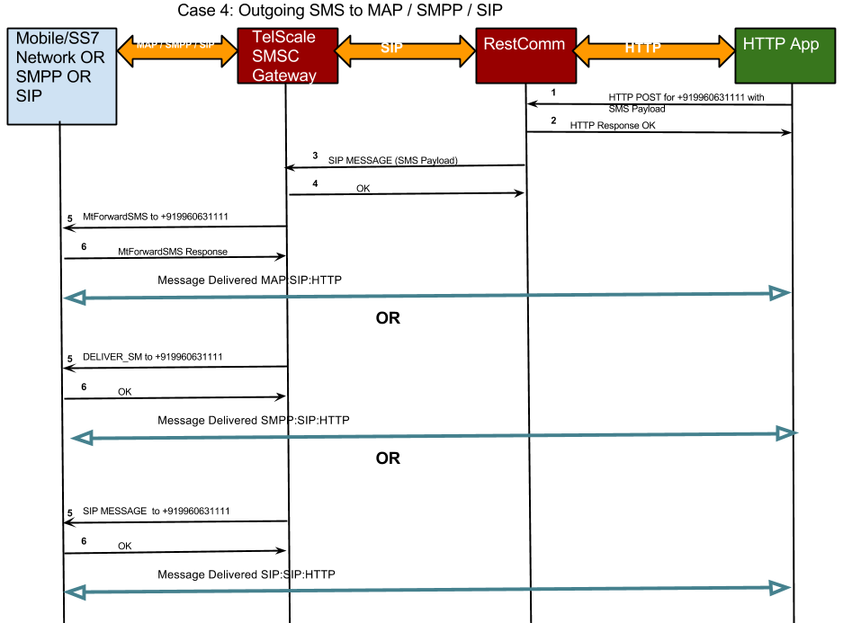

[[_smsc_restcomm]]
= SMSC RestComm-Connect Integration

RestComm-Connect is a next generation cloud communications platform to rapidly build voice, video and realtime  messaging applications, using mainstream development skills.
 

RestComm-Connect is a turnkey Cloud Communications platform based on Open Source building blocks from the team behind Restcomm.
RestComm offers a clean room implementation of the Twilio.com APIs and much more. 

RestComm-Connect can be integrated with VoIP and legacy SS7 network providers either in the cloud or via on-premise Resource Adaptors.
For further details on RestComm please visit http://restcomm.com[restcomm.com]		

== {this-platform} {this-application} Integration with RestComm-Connect Architecture

{this-platform} {this-application} integrates with RestComm-Connect over SIP.
The below sections describe flow of SMS messages between SMSC, RestComm and Applications over RestComm. 

=== Incoming SS7 message

Below diagram shows flow of a message coming from SS7 and getting delivered to Application over RestComm-Connect.
 

image::images/SMSC-RestComm-Incoming-SS7.png[]					 

=== Incoming SMPP message

Below diagram shows flow of a message coming from SMPP and getting delivered to Application over RestComm-Connect.
 

image::images/SMSC-RestComm-Incoming-SMPP.png[]					 

=== Incoming SIP message

Below diagram shows flow of a message coming from SIP and getting delivered to Application over RestComm-Connect.
 

image::images/SMSC-RestComm-Incoming-SIP.png[]					 

=== Outgoing message from Application over RestComm

Below diagram shows flow of a message from application over RestComm-Connect and getting delivered to {this-platform} {this-application} .
 

					 

== Customized SIP Headers

SMS messages can be of UTF-8 or Unicode Characters, or there can be special messages with user data headers (UDH), binary messages, SMS that indicates delivery receipt etc.
There is no one-to-one mapping for this information in SIP, hence {this-platform} RestComm has introduced additional customized SIP Headers to convey this useful information as described below. 

[NOTE]
====
					To understand each of the below optional parameters please read SMPP Specifictaion.
				
====				 

X-SMS-UDH::
  This parameter carries the hex string of User Data Header.
  For example, X-SMS-UDH=06050413011301.
  RestComm can include this header for outgoing SIP MESSAGE and SMSC will include it in actual SMS.
  If incoming SMS has UDH, then the SIP MESSAGE from SMSC will include this optional header. 

X-SMS-CODING::
  This is the parameter for message coding.
  When unset, defaults to 0 (7 bits) if Content-Type is text/plain , text/html or text/vnd.wap.wml; for application/octet-stream, defaults to 8 bits (1); 2 is UCS2.
  RestComm can include this header for outgoing SIP MESSAGE and SMSC will include it in actual SMS.
  For incoming SMS, the SIP MESSAGE from SMSC will include this optional header. 

X-SMS-VALIDITY::
  This parameter holds the SMS validity period in case of re-try.
  Validity Period is in the format yyyyy-mm-dd hh:mm:ss.
  RestComm can include this header for outgoing SIP MESSAGE and SMSC will respect the validity period for failed delivery (re-try). For incoming SMS, the SIP MESSAGE from SMSC will include this optional header. 

X-M-CLASS::
  This parameter holds the message class bits of DCS; 0 (directly to display, flash), 1 (to mobile), 2 (to SIM) or 3 (to SIM toolkit). This is not yet supported in the current version of SMSC. 

X-REG-DELIVERY::
  This is registered_delivery parameter and is used to request a SMSC delivery receipt and/or SME originated acknowledgements.
  This is set to 1 to get delivery receipt for success or failure. 

X-SMSC-ID::
  This parameter holds the smsc-id of the connection that received the message.
  If the incoming SMS was from ESME, smsc-id will be the name of the ESME.
  In case of messages coming in from SIP or SS7, this value will be null. 

X-DELIVERY_TIME::
  This is time the message was received by SMSC.
  Format will be "yyyyy-mm-dd hh:mm:ss". 				  
