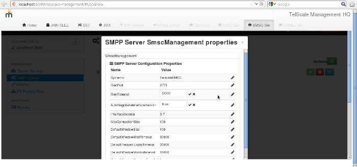

[[_smpp_server_settings]]
= SMPP Server Settings

[[_smpp_server_settings_view]]
== View SMPP Server Details

[[_smpp_server_settings_view_gui]]
=== Using GUI

.Procedure: View SMPP Server Details using the GUI
. In the GUI Management Console for SMSC Gateway, click on 'SMPP Server' in the left panel. 
. The main panel will display the existing SMPP Server details as configured in the section `SmscManagement` in the xml descriptor file [path]_{this-folder}-smsc-<version>/jboss-5.1.0.GA/server/<profile>/deploy/{this-folder}-smsc-server/META-INF/jboss-beans.xml_. 
. You can view the current Session details of the SMPP Server by clicking on the row corresponding to the name of the SMPP Server (`SmscManagement` in this case). 

[[_smpp_server_settings_edit]]
== Edit SMPP Server Properties

[[_smpp_server_settings_edit_cli]]
=== Using CLI

You can edit the properties of the SMPP Server by issuing appropriate commands for every property as described below: 

----

Name
	smpp smppserver set port

SYNOPSIS
	smpp smppserver set port <port>

DESCRIPTION
	This command is used to set the port that the SMSC server is listening to for 
	incoming bind request. 

	If unspecified, the default port is 2776.

	You must restart the SMPP Server for the new value to take effect.
----

----

Name
	smpp smppserver set bindipaddress

SYNOPSIS
	smpp smppserver set bindipaddress <ip-address>

DESCRIPTION
	This command is used to set the IP for SMPP server.
	The SMSC server will use this ip for listening incoming bind request from SMPP client.

	If unspecified, the default value is 0.0.0.0, that means SMPP server will listen on all interfaces.

	You must restart the SMPP Server for the new value to take effect.
----

----

Name
	smpp smppserver set bindtimeout

SYNOPSIS
	smpp smppserver set bindtimeout <bind-timeout>

DESCRIPTION
	This command is used to set a value for bind-timeout in milli-seconds. 
	Once the TCP socket is established, the SMSC server will wait for the time period 
	specified by the parameter bind-timeout in milli-seconds, for the peer to send a 
	bind request, after which it will kill the TCP socket.

	If unspecified, the default value is 5000 milli-seconds.

	You must restart the SMPP Server for the new value to take effect.
----

----

Name
	smpp smppserver set writetimeout

SYNOPSIS
	smpp smppserver set writetimeout <bind-timeout>

DESCRIPTION
	This command is used to set a value for write-timeout in milli-seconds.
	This parameter sets a timeout which occurs when we can not properly sent
	a message into TCP channel.

	If unspecified, the default value is 0 (no timeout).

	You must restart the SMPP Server for the new value to take effect.
----

----

Name
	smpp smppserver set systemid

SYNOPSIS
	smpp smppserver set systemid <system-id>

DESCRIPTION
	This command is used to set the value for system-id. This is the 'system-id' 
	included in the Bind response.

	You must restart the SMPP Server for the new value to take effect.
----

----

Name
	smpp smppserver set autonegotiateversion

SYNOPSIS
	smpp smppserver set autonegotiateversion <true/false>

DESCRIPTION
	This command is used to specify if auto-negotiate-version is enabled or not.
	If it is set to 'true' and a Bind is received with version <= 3.3 for 
	interface version, then it is normalized to version 3.3. If a Bind is received 
	with version >= 3.4 for interface version, it is normalized to version 3.4.

	The default value is true.

	You must restart the SMPP Server for the new value to take effect.
----

----

Name
	smpp smppserver set interfaceversion

SYNOPSIS
	smpp smppserver set interfaceversion <interface-version>

DESCRIPTION
	This command is used to specify the SMPP version that the Server supports. 

	You must restart the SMPP Server for the new value to take effect.
----

----

Name
	smpp smppserver set maxconnectionsize

SYNOPSIS
	smpp smppserver set maxconnectionsize <max-connection-size>

DESCRIPTION
	This command is used to specify the maximum number of connections/sessions this 
	Server is expected to handle.

	You must restart the SMPP Server for the new value to take effect.
----

----

Name
	smpp smppserver set defaultwindowsize

SYNOPSIS
	smpp smppserver set defaultwindowsize <defaultwindowsize>

DESCRIPTION
	This command is used to specify the default window size for this Server. 
	The window size is the amount of unacknowledged requests that are permitted to be 
	outstanding/unacknowledged at any given time. If more requests are added, the 
	underlying stack will throw an exception.

	The default value is 100.

	You must restart the SMPP Server for the new value to take effect.
----

----

Name
	smpp smppserver set defaultwindowwaittimeout

SYNOPSIS
	smpp smppserver set defaultwindowwaittimeout <default-window-wait-timeout>

DESCRIPTION
	This command is used to specify the default-window-wait-timeout for this Server
	in milli-seconds. 
	The window wait timeout is the time within which the connection to remote SMSC
	Server should be established.

	The default value is 30000 milli seconds.

	You must restart the SMPP Server for the new value to take effect.
----

----

Name
	smpp smppserver set defaultrequestexpirytimeout

SYNOPSIS
	smpp smppserver set defaultrequestexpirytimeout <default-request-expiry-timeout>

DESCRIPTION
	This command is used to specify the default-request-expiry-timeout for the Server 
	in milli-seconds. The request expiry timeout is the time to wait for an end-point 
	to respond to before it expires.

	The default value is 30000 milli seconds.

	You must restart the SMPP Server for the new value to take effect.
----

----

Name
	smpp smppserver set defaultwindowmonitorinterval

SYNOPSIS
	smpp smppserver set defaultwindowmonitorinterval <default-window-monitor-interval>

DESCRIPTION
	This command is used to specify the default-window-monitor-interval for the Server 
	in milli-seconds. This is the time between executions of monitoring the window for
	requests that expire. It is recommended that this value, generally, either matches 
	or is half the value of 'request-expiry-timeout'. Therefore, in the worst case
	scenario, a request could take upto 1.5 times the 'requestExpiryTimeout' to 
	clear out.

	The default value is 15000 milli seconds.

	You must restart the SMPP Server for the new value to take effect.
----

----

Name
	smpp smppserver set defaultsessioncountersenabled

SYNOPSIS
	smpp smppserver set defaultsessioncountersenabled <true/false>

DESCRIPTION
	This command is used to set the parameter 'defaultsessioncountersenabled' value 
	to true or false.
	When this is enabled, SMSC exposes the statistics for SMPP connections.

	The default value is true.

	You must restart the SMPP Server for the new value to take effect.
----

[[_smpp_server_settings_edit_gui]]
=== Using GUI

.Procedure: Edit SMPP Server Properties using GUI
. In the GUI Management Console for SMSC Gateway, click on 'SMPP Server' in the left panel. 
. The main panel will display the existing SMPP Server details as configured in the section `SmscManagement` in the xml descriptor file [path]_{this-folder}-smsc-<version>/jboss-5.1.0.GA/server/<profile>/deploy/{this-folder}-smsc-server/META-INF/jboss-beans.xml_. 
. You can edit the properties of the SMPP Server by launching the edit window.
You can achieve this by clicking on the blue coloured 'edit' button at the end of the row.
The edit window will display all SMPP properies as shown in the figure below.
For more details of these parameters please refer to the descriptions of the CLI commands for the same in the preceding section.
+
.SMPP Server - GUI - {this-platform} {this-application} 

. To edit any property, click on the edit icon of the row corresponding to the property.
  This action will display an editable text field for the property as shown in the figure above.
  Adjacent to the editable text field, you will find a 'tick' icon and a 'x' icon.
  To accept the newly entered value for the property, you must click on the 'tick' icon.
  To discard the change and  stop the editing of the property, you must click on the 'x' icon. 
+
SMPP Server can be setup for SSL so every incoming connection request should first do SSL hand-shake.
Settingup SSL is only possible from GUI. 

. You must click on the button 'Apply Changes' at the top of the window to save your settings.
  If there is an error in setting the value, then you will find the details of the error in the Management Console Log section below. 

[[_smpp_server_settings_start]]
== Start SMPP Server

[[_smpp_server_settings_start_gui]]
=== Using GUI

.Procedure: Start SMPP Server using GUI
. In the GUI Management Console for SMSC Gateway, click on 'SMPP Server' in the left panel. 
. The main panel will display the existing SMPP Server details as configured in the section `SmscManagement` in the xml descriptor file [path]_{this-folder}-smsc-<version>/jboss-5.1.0.GA/server/<profile>/deploy/{this-folder}-smsc-server/META-INF/jboss-beans.xml_. 
. You can start the SMPP Server by clicking on the 'Start' icon lit green in the row corresponding to the SmscManagement unit.
  This icon will be enabled only if the SMPP server is currently stopped. 
. This action will start the SMPP Server. 
. If there is an error in starting the SMPP Server, then you will find the details of the error in the Management Console Log section below. 

[[_smpp_server_settings_stop]]
== Stop SMPP Server

[[_smpp_server_settings_stop_gui]]
=== Using GUI

.Procedure: Stop SMPP Server using GUI
. In the GUI Management Console for SMSC Gateway, click on 'SMPP Server' in the left panel. 
. The main panel will display the existing SMPP Server details as configured in the section `SmscManagement` in the xml descriptor file [path]_{this-folder}-smsc-<version>/jboss-5.1.0.GA/server/<profile>/deploy/{this-folder}-smsc-server/META-INF/jboss-beans.xml_. 
. You can stop the SMPP Server by clicking on the 'Stop' icon lit red in the row corresponding to the SmscManagement unit.
  This icon will be enabled only if the SMPP server is currently running. 
. This action will stop the SMPP Server. 
. If there is an error in stopping the SMPP Server, then you will find the details of the error in the Management Console Log section below. 

[[_smpp_server_settings_reset_counters]]
== Reset Counters for SMPP Server

[[_smpp_server_settings_reset_counters_gui]]
=== Using GUI

.Procedure: Reset Counters for SMPP Server using GUI
. In the GUI Management Console for SMSC Gateway, click on 'SMPP Server' in the left panel. 
. The main panel will display the existing SMPP Server details as configured in the section `SmscManagement` in the xml descriptor file [path]_{this-folder}-smsc-<version>/jboss-5.1.0.GA/server/<profile>/deploy/{this-folder}-smsc-server/META-INF/jboss-beans.xml_. 
. You can view the current Session details of the SMPP Server by clicking on the row corresponding to the name of the SMPP Server (`SmscManagement` in this case). 
. This action will display the current session details of the SMPP Server.
  If you scroll to the bottom, you will find a button named 'Reset Counters'. Click on it if you wish to reset all counters for SMPP Server. 
. If there is an error resetting the counters, then you will find the details of the error in the Management Console Log section below. 
